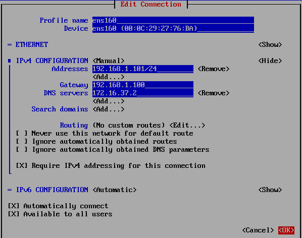

# 配置网络

配置网络不是必要步骤，服务器厂商装机时可能已经配置完毕。需要根据实际情况进行操作。

### 独立服务器

购买网线后直接将机器的以太网口和机房交换机或者墙上的有线网口相连即可。获取 IP 的方式基本是 DHCP（自动获取，也是默认值），具体询问自己单位的网络中心。

### 手动配置集群

对于一个小型集群，最简单的局域网架构如下：

* 所有节点通过网线连接到管理网段交换机，并配置局域网。
* 所有节点通过网线连接到计算网段交换机，并配置局域网（可选）。
* 登录节点的另一个网口通过网线连接到机房交换机或有线网口。

也就是说，如果考虑计算网，计算节点、存储节点等需要连两根网线，而登录节点需要三根（因此登录节点最好有三张以上的网卡，且有一个是高速网网卡）。而网络通讯模型将会是这样：


如果不考虑计算网，那么计算、存储节点需要连一根网线，登录节点需要两根（一般服务器至少会有两个千兆以太网口）。

#### 配置 IP

登录节点对外仍然直接使用网线相连，并配置为自动获取 IP。而局域网一般不设置 DHCP 服务器，要配置**静态 IP**。CentOS 7 提供了 `nmtui` 工具（字符图形界面，或其命令行模式 `nmcli`），可方便配置 IP 地址。

`nmtui` 可以**配置网络连接、设置主机名**，选择插上交换机的网络接口之后，手动分配 IP 即可。



由于登录节点对外连接的网络接口已经根据 DHCP 服务器自动配置 IP、DNS、网关等信息，因此登录节点连接内网交换机的这个接口就**不要配置默认路由**（计算节点需要上网的情形除外）**。**



有些单位的网络（对于你的这组机器算外网）本身采用的是局域网形式的地址，如 `10.0.0.0/8`，配置集群的局域网时不要和这些网段冲突。具体可询问自己的网络中心。


在我这组示例中，我使用 `nmtui` 配置了一个具有四个节点的简单集群：

* 登录节点：`192.168.1.100` 
* 存储节点：`192.168.1.101` 
* 计算节点 1：`192.168.1.11` 
* 计算节点 2：`192.168.1.12` 

配置完毕后可以尝试使用 `ping` 来测试网络是否畅通。例如：

```text
ping 192.168.1.101 # 从登录节点 ping 存储节点
PING 192.168.1.101 (192.168.1.101) 56(84) bytes of data.
64 bytes from 192.168.1.101: icmp_seq=1 ttl=64 time=0.753 ms
64 bytes from 192.168.1.101: icmp_seq=2 ttl=64 time=0.944 ms
64 bytes from 192.168.1.101: icmp_seq=3 ttl=64 time=0.908 ms
64 bytes from 192.168.1.101: icmp_seq=4 ttl=64 time=0.906 ms
```

#### 配置主机名（hostname）

使用 `nmtui` 可以设置主机名，在界面中直接设置即可。设置成功后重新登录系统即可看到主机名变化。在例子中主机名被设置为：

* 登录节点：`login01` 
* 存储节点：`io01` 
* 计算节点（两台）：`c[01-02]`

#### 设置 hosts 文件

虽然设置了主机名，但登录节点还不知道谁的名字叫做 `io01` ，需要记录主机名和地址对应信息。而这个记录是利用了 `/etc/hosts` 文件。

hosts 文件的示例如下：

```text
127.0.0.1   localhost localhost.localdomain localhost4 localhost4.localdomain4
::1         localhost localhost.localdomain localhost6 localhost6.localdomain6

192.168.1.100 login01
192.168.1.101 io01
192.168.1.11  c01
192.168.1.12  c02
# 以下省略
```

这个文件在集群**所有节点**都必须相同。编辑好文件后从一台节点就可以方便使用主机名访问另一个节点了，可以测试 `ping io01` 查看效果。

#### 计算节点连接外网（NAT）

你可能注意到，登录节点可以从外面访问，自然也可以上网。但其它节点（计算、存储）则不能从互联网下载东西，这可能造成一些麻烦（例如安装软件）。这需要将登录节点配置成 [NAT 服务器](https://en.wikipedia.org/wiki/Network_address_translation)。概括来说，其它节点访问外网都要先经过登录节点，登录节点访问后再将数据回传给原节点。这种模式也称登录节点是其它节点的**网关（gateway）**。


该配置是可选的，计算节点不一定需要上网。配置 NAT 后从外部依然不能访问计算节点。


在登录节点，配置防火墙的 ipv4 转发：

```text
firewall-cmd --zone=public --add-masquerade --permanent
```

同时将连接内网的网络接口（假设是 ens36，具体名字可查询 `nmtui` 配置时的信息）关联至 trusted：

```text
firewall-cmd --zone=trusted --add-interface=ens36 --permanent
```

最后重新载入防火墙配置：

```text
firewall-cmd --reload
```

如果配置正确，可以使用 `firewall-cmd --list-all-zones` 查看结果，正确应该有类似下面的输出：

```text
public (active)
  target: default
  icmp-block-inversion: no
  interfaces: ens160
  ...
  masquerade: yes
  ...
	

trusted (active)
  target: ACCEPT
  icmp-block-inversion: no
  interfaces: ens36
  ...
```

在这个例子中，`ens160` 这个网络接口连接外部网络，`ens36` 这个接口连接内网交换机。

在计算节点（存储节点），将登录节点设置为网关（使用 `nmtui`）。



需要注意如下方面：

* Gateway 字段填写的是登录节点的 IP。
* DNS servers 填写的是登录节点自动获取的 DNS 服务器地址（可以通过在登录节点 `cat /etc/resolv.conf` 进行查询，如果有多个地址就都写上）。
* 由于涉及数据的转发，需要**去掉**“Never use this network for default route”选项。
* 配置完毕后重启网络服务以生效（`systemctl restart NetworkManager`）


如果集群有多个局域网网段（例如存在计算网），只能在其中的一个网段配置 NAT（建议在管理网段上配置），其它网段仍然维持原有状态。


配置完毕后测试是否真的可以从存储节点联网。例如执行 `curl www.baidu.com` 可以看到百毒的输出等。

### 查看服务器制造商配置好的集群

如果是购买集群套装，以上 IP 地址等配置可能服务器厂商帮你做了。他们一般也会编写 hosts 文件，想要知道基本信息查看这个文件即可。也可以用 `ip addr` 这样的命令查看本机 IP。


查看厂家的 IP 配置时可能会发现他们会使用 `11.11.11.1` 这样奇奇怪怪的地址（例如浪潮公司 inspur）。这种没有使用局域网地址（A/B/C 类）的配置是可以工作的，但 `11.11.11.1` 对应的公网 IP 就不能访问了。猜想可能是工程师上岗培训的时候就是这样教的。



服务器制造商可能不会帮你配置计算节点连外网。如果有这方面的需求，请参考上一小节。


### 总结

这里介绍了三种常见的需要配置网络的情形，概括来说需要做以下事情。

* 如果是一台独立服务器，只需要插网线即可。
* 如果需要手动配置：
  * 登录节点插外网网线，所有节点连接交换机（如果有多个网段就都连上）。
  * 使用 `nmtui` 手动配置内网 IP、主机名。
  * 编写 hosts 文件。
  * （可选）如果处于内网机器需要上网，需要配置 NAT（登录节点配置防火墙转发，计算存储等节点设置网关和 DNS）
* 如果服务器厂商已经帮忙配好，可以通过检查 hosts 文件来获取信息。

