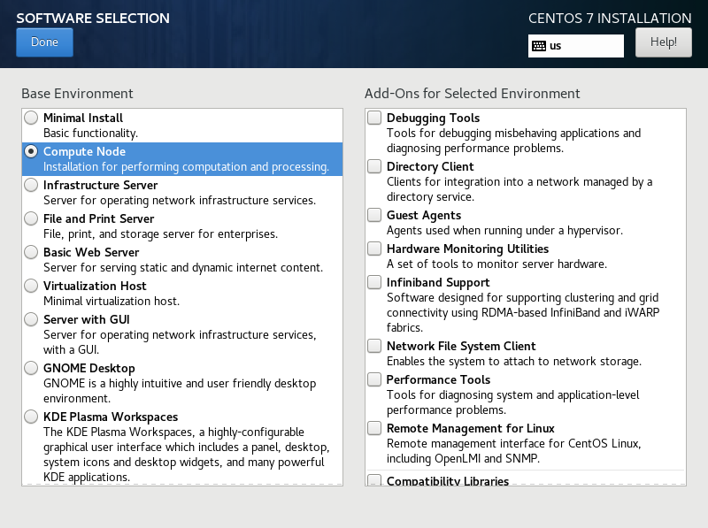

# 操作系统

操作系统重装不是必要步骤，一般只有当购买单独的服务器或者新购入服务器并入已有集群的时候才需要考虑。

对于小型的自建集群，推荐选择如下操作系统（以下推荐有先后顺序）：

* CentOS 7：2020 年之前最流行的服务器操作系统，也是目前许多服务器厂商的首选。需要注意的是 CentOS 7 的生命周期到 2024 年，到时需要寻找额外替代。由于 CentOS 转型，不建议安装 CentOS 8 或者 CentOS-Stream。目前 [Rocky Linux ](https://rockylinux.org/)是相关的替代，不过系统还在开发中，需要进一步观望。
* Debian：（目前）为数不多的社区版服务器操作系统，稳定性也有保证，各个软件包支持完善。不过不知道为什么国内厂商很少自带这个系统，因此放在推荐第二位。
* Ubuntu Server：桌面版 ubuntu 的服务器版本，由于本身也是 debian 衍生出来的，所以有差不多的稳定性。
* RedHat Enterprise Linux \(RHEL\)：商业版 Linux，有钱可以考虑购买，有售后服务。不过对于小规模集群实在是没什么必要。


本指南的操作基于 **CentOS 7** 编写，部分命令只能在 CentOS 7 上执行。


安装操作系统这里不做过多说明，和给自己笔记本安装基本完全一致。CentOS 7 需要选择安装模式，如下图。一般选择 **Compute Node** 就好，右边的 Add-On 可以根据个人情况选择。服务器系统一般不需要图形用户界面（GUI）。

