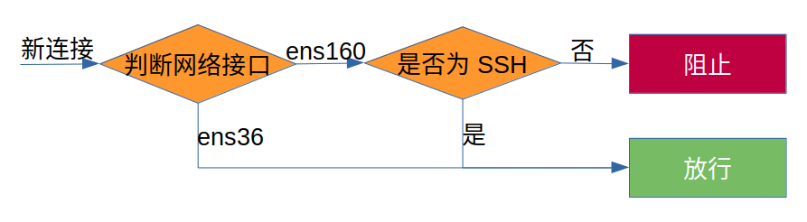
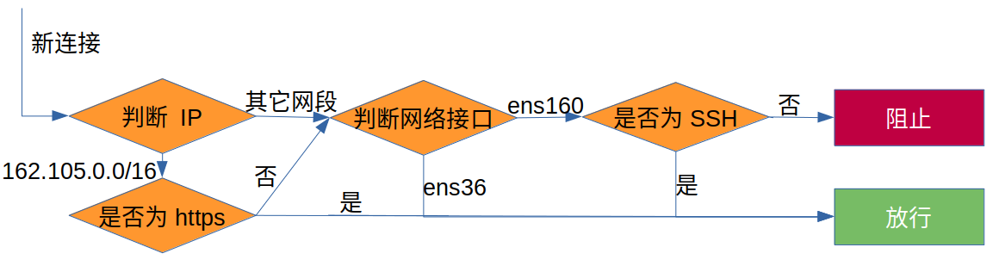

# 系统安全策略

在正式投入使用之前，管理员需要注意服务器安全策略方面的配置，不加任何保护将服务器开放给外网访问是十分危险的。因此强烈建议管理员看完这一页面的**每一个条目**。


系统安全配置是非常重要的环节，很多服务器厂商不会帮你完成这一步，导致的后果就是机器刚买没几天就会被黑客黑入，成为他们的肉鸡（用于病毒扩散或者挖矿等）。


### 修改 root 密码

一般系统的初始 root 密码非常简单，例如 111111 或者 123456，改掉这个密码是基本常识。修改时，建议新密码在 15 位以上，且使用大小写字母，数字，下划线，特殊符号混排的形式，并牢记下来。集群中所有节点的 root 账号密码可以设置成统一的。

### 禁止 root 远程登录

一般的恶意程序首要攻击目标是集群的 root 用户，基本方式是扫描到集群 IP 后就会对 SSH 默认端口 22 发动暴力破解攻击，通过猜 root 密码的方式黑入集群。有效的应对方式是**修改 SSH 端口**以及**禁止 root 用户登录**，详见[配置 SSH](https://ryanbernx.gitbook.io/cluster-admin/system/ssh) 相关页面。

### 系统防火墙

CentOS 7 的防火墙是由 `firewalld` 控制的，该服务实际是对底层防火墙操作的一个包装（iptables 或 nftables 等），默认是**开启状态**。系统默认防火墙行为：

* 放行所有外网入站的 SSH 连接（22 端口）；
* 放行所有出站连接（不限制从本机到外网的访问）；
* 阻挡所有外网入站的其它连接。

`firewalld` 的配置逻辑十分直观：首先根据放行规则定义一系列的情景模式（zone），然后系统根据一些条件（例如使用的网络接口，IP 地址等）来判断相应网络连接应该套用哪一个 zone 下的规则，最终确定处理该连接的方式（放行，阻挡，转发等）。

回忆在配置网络时，我们将登录节点的 ens36 网络接口关联至 trusted，相当于添加了一个判断：当连接是从 ens36 这个接口发出或者接收时，无条件放行。这里我们总假设来自内网的连接是安全的（不会有恶意用户来捣乱）。登录节点遇到新入站连接时防火墙的判断逻辑就会变成下图这样：



这样的判断逻辑可以保护部分服务不会被外网轻易访问到，例如前面配置的 NFS，NIS 等。当然，如果用户自己在登录节点上运行网络服务，也会因为防火墙阻挡的缘故不能访问。


由于放行了 SSH 连接，`firewalld` 在当前配置下对 SSH 服务没有任何防护能力。


#### 配置防火墙放行特定端口或服务

如果在登录节点开启了其它服务且希望外界访问，需要在防火墙配置中放行连接。例如，想要放行 http/https 服务就需要执行：

```text
firewall-cmd --zone=public --add-service=https --permanent
firewall-cmd --zone=public --add-service=http --permanent
firewall-cmd --reload
```

即可放行 80 和 443 端口。这里 `--add-service=https` 实际上是调用了 `firewalld` 预定义 `https` 配置文件。

如果想放行特定端口（例如 25000 的 tcp 端口），需要执行：

```text
firewall-cmd --zone=public --add-port=25000/tcp --permanent
firewall-cmd --reload
```

#### 限制特定 IP 访问

如果只希望特定的 IP 网段访问某个具体服务，例如只允许 `162.105.0.0/16` 网段访问 https 服务，则需要新建一个 zone 并配置相关服务

```text
firewall-cmd --new-zone=int --permanent
firewall-cmd --reload # 新添加情景模式后需要 reload
firewall-cmd --zone=int --add-service=https --permanent
firewall-cmd --zone=int --add-source=162.105.0.0/16 --permanent
firewall-cmd --reload
```

此时遇到新连接后防火墙的判断逻辑是这样：



可以看到防火墙会**优先判断 IP**地址，当 IP 地址不满足时**不会**马上阻止连接，而是继续判断网络接口是否匹配。在配置防火墙规则时一定要牢记这个特性。

### 配置 fail2ban

在实际使用中，服务器每天会受到许多恶意 IP 的扫描和暴力破解，把这些 IP 禁止掉是必要的。使用高强度密码虽然可以防止暴破，但这会导致 守护进程每天都要处理很多无效的请求，这会降低服务器的效率，因此设置防火墙直接拦下可疑 IP 是更好的做法。`fail2ban` 软件恰好可以满足这一需求。

首先在登录节点安装 `fail2ban` 软件（ 需要预先启用 epel 源）：

```text
yum install fail2ban
```

默认情况下 `fail2ban` 不开启对任何服务的监测，需要手动配置，方法是修改 `/etc/fail2ban/jail.local` 文件（这个文件一开始不存在，需要新建一个）。以下内容以监测 SSH 服务为例。


```text
[sshd]
# 如果更改过 ssh 端口，请恢复以下注释内容（9012 替换为实际端口）
# port = 9012

# 启用 
enabled = true

# 查找 10 分钟之内的 log
findtime = 10m

# 登录错误数最多 5 次
maxretry = 5

# 封禁的时间
bantime = 1h
```


配置完毕后，重新启动 `fail2ban` 服务并设置开机自启：

```text
systemctl restart fail2ban
systemctl enable fail2ban
```

如下命令可以查看当前的状态，或者手动解封被禁止的 IP：

```text
fail2ban-client status sshd  # 查看 sshd 拦截状态
fail2ban-client set sshd unbanip <IP>  # 手动解封被拦截的 IP
```

### 新用户随机密码

创建新用户时，初始密码不要设置为过于简单序列，例如 123456，或者和用户名相同。这是因为如果普通用户被人盗用，侵入者还是可以利用集群进行一些危害性较强的活动（例如攻击其它机器，挖矿等）。最好是设置一些比较随机的密码，例如：

```bash
#!/bin/bash
pass=`uuidgen`

# 在屏幕上显示 pass 的值
echo $pass

# 将用户 jack 的密码设置为 pass
echo $pass | passwd --stdin jack
```

这样每次重设密码都会使用一个随机的 uuid，提高安全性。

### 关闭 SELinux

SELinux（Security-Enhanced Linux）是 Linux 的安全加强模式，其提供了更加严格的权限控制和策略。在 CentOS 7 中 SELinux 默认是**开启**的。但这里我们是要考虑关闭这个模块，原因如下：

1. SELinux 配置复杂，学习难度大，本身设计是给想越权的人带来一定限制，但如此庞大的机制先把管理员绕晕了。
2. 文件系统提供的权限机制在小型集群上已经够用，只要稍微注意尽量不使用 root 用户运行服务就不会有太大问题。

SELinux 有三种模式：enforcing，permissive，disabled。可以使用 `sestatus` 命令查询，默认是 **enforcing**。三者的区别：

* enforcing：启用 SELinux，并且严格遵守 SELinux 的安全策略。
* permissive：启用 SELinux，但对违反策略的行为不真正阻止，只记录日志。
* disabled：关闭 SELinux。

由于 SELinux 启用时需要在文件系统中构建数据，如果直接关闭，在系统运行一段时间后重新启用 SELinux，则会在开机过程中占用大量时间重新构建 SELinux 数据（中途异常中断可能导致系统无法开机）。所以**不推荐直接设置为 disabled** ，设置成 permissive 是个很好的折中。

“关闭” SELinux 的方式是修改 `/etc/selinux/config` 文件（第 6 行）：


```text
# This file controls the state of SELinux on the system.
# SELINUX= can take one of these three values:
#     enforcing - SELinux security policy is enforced.
#     permissive - SELinux prints warnings instead of enforcing.
#     disabled - No SELinux policy is loaded.
SELINUX=permissive
# SELINUXTYPE= can take one of three values:
#     targeted - Targeted processes are protected,
#     minimum - Modification of targeted policy. Only selected processes are protected. 
#     mls - Multi Level Security protection.
SELINUXTYPE=targeted 
```


修改完毕后直接重启即可。重启后使用 `sestatus` 验证目前模式确实是 permissive。

### 限制普通用户使用 su（可选）

`su` 命令可以使得已经登录的用户切换身份，例如管理员常用的 `sudo su -`  。如果不希望普通用户使用这个命令，可以设置只有 wheel 组的用户才能使用，方法是更改 `/etc/pam.d/su` 这个文件：


```text
#%PAM-1.0
auth		sufficient	pam_rootok.so
# Uncomment the following line to implicitly trust users in the "wheel" group.
#auth		sufficient	pam_wheel.so trust use_uid
# Uncomment the following line to require a user to be in the "wheel" group.
auth		required	pam_wheel.so use_uid
auth		substack	system-auth
auth		include		postlogin
account		sufficient	pam_succeed_if.so uid = 0 use_uid quiet
# （以下省略）
```


其实就是就第 6 行的注释去掉。设置成功后，下次登录就会生效。

